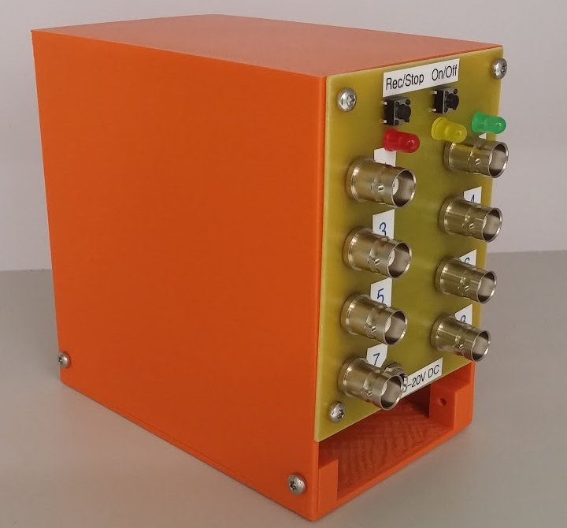
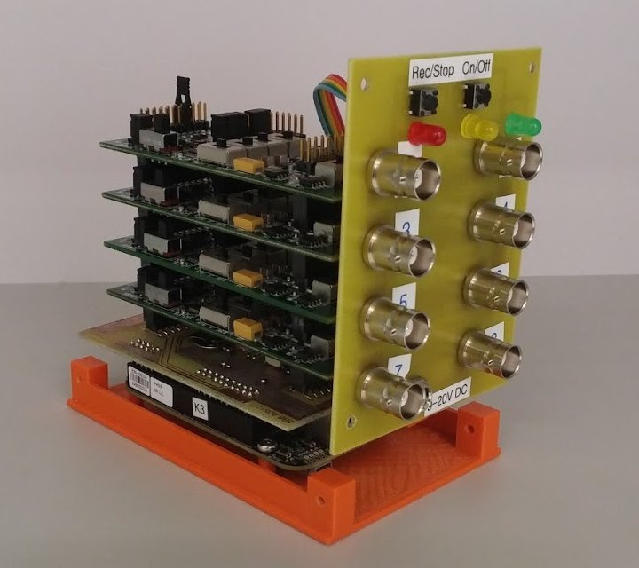
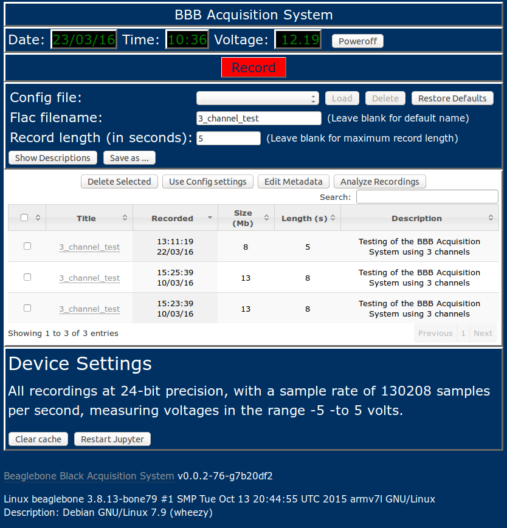
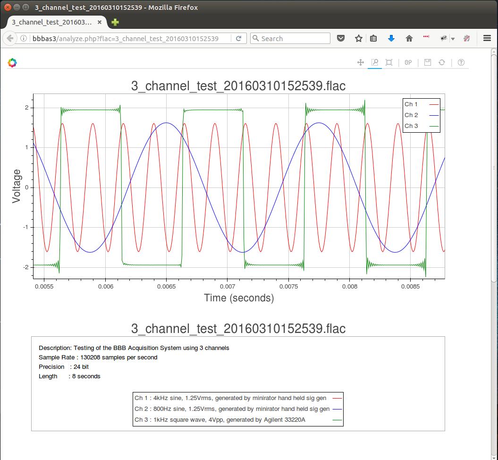
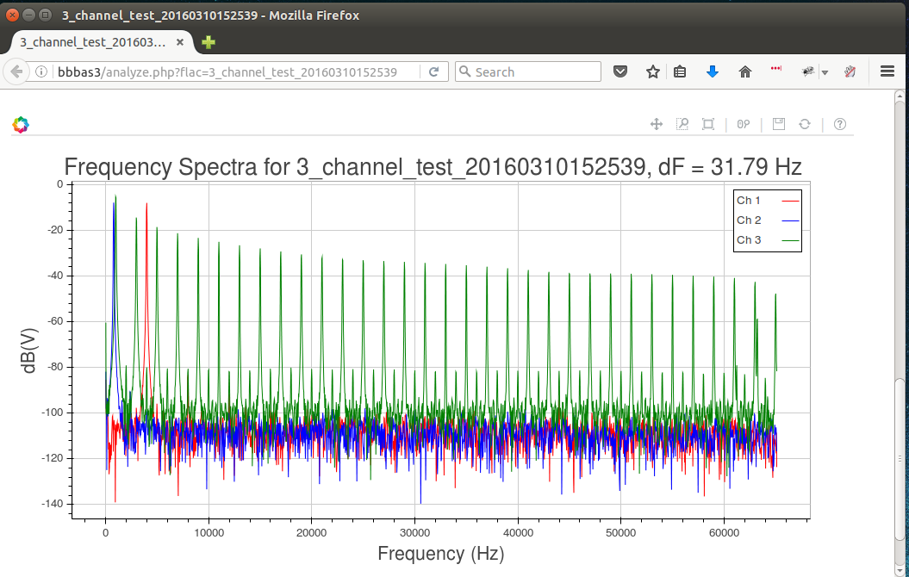
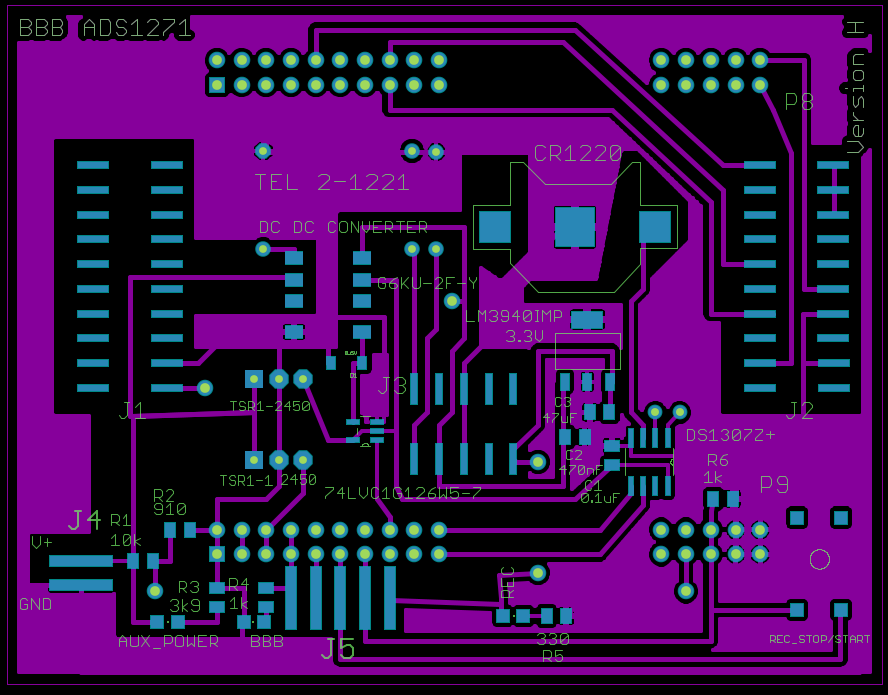
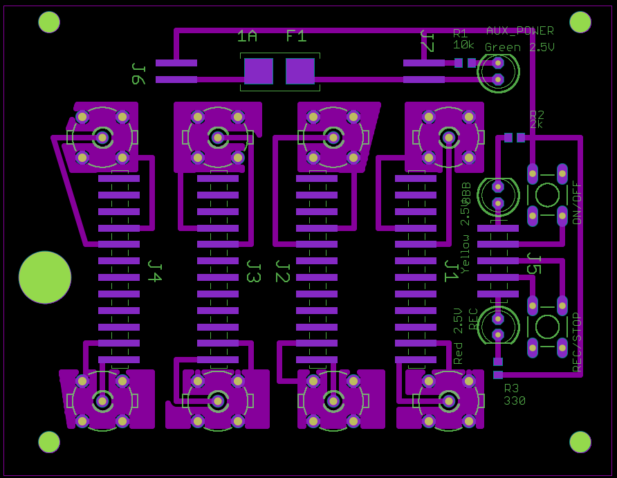
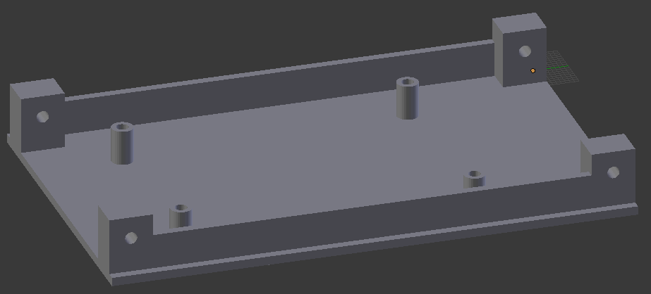
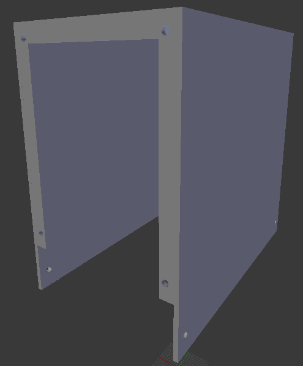

# BEAGLEBONE BLACK ACQUISITION SYSTEM

__IMPORTANT: This project was last updated in 2017, so many commands and links are likely to be out of date.__

## Introduction

This project will show you how to create an 8 channel 24-bit 130 kSPS 
data acquisition system using a Beaglebone Black, four ADS1271 
Evaluation modules and a few other electronic bits and pieces.











The aim of this project is to give people access to a reliable, 
high-precision data acquisition system which runs at a respectable 
sample rate without having to shell out tens of thousands of dollars.

## Client-side App

The acquisition system can be controlled with any browser, however, to check on the
progress of a recording, or look at the third octave levels of an input, it is necessary
to run a python script on the computer used to access the BBBAS.

To use the client-side app, you need to install python, as well as numpy and bokeh.
So far, the client-side app has only been tested in linux.
The client side app is run using the command
```
BBBASDIR=~/bbb-acquisition-system
bokeh serve --unused-session-lifetime 10 --port 5006 $BBBASDIR/source/third_octave_local.py $BBBASDIR/source/record_progress.py
``` 
This assumes that you have cloned the bbb-acquisition-system repository into
your home directory.


## Bill of Materials

| Product | (Approx.) Price<sup>1</sup> (US$) |
|---------|----------------------------------:|
| [Beaglebone Black]                                          |  $55 |
| [ADS1271EVM] ( 4 @ $49 )                                    | $196 |
| [12V 2A DC Power Supply]<sup>2</sup>                        |   $4 |
| [2Gb microSD card]<sup>3</sup>                              |   $2 |
| [larger microSD card]<sup>4</sup>                           |   $4 |
| [BBB_ADS1271 Cape](#Cape)                                   |  $80 |
| [BBB ADS1271 Front Panel](#FrontPanel)                      |  $30 |
| [Wifi dongle] (optional)                                    |  $12 |
| __Case (optional)__ 
| [Base](#Base) (27 cm<sup>3</sup> of plastic)                |  $10 |
| [Cover](#Cover) (91 cm<sup>3</sup> of plastic)              |  $25 |
| __TOTAL__                                               | __$418__ |

[Beaglebone Black]:http://beagleboard.org/BLACK
[ADS1271EVM]: http://www.ti.com/tool/ads1271evm
[12V 2A DC Power Supply]: http://www.ebay.com/sch/12v+2a+power+supply
[2Gb microSD card]: http://www.ebay.com/sch/2Gb+micro+SD+card
[larger microSD card]: http://www.ebay.com/sch/micro+SD+card
[Wifi dongle]: https://www.adafruit.com/products/814
__Footnotes__:
 
<sup>1</sup>Some components will need to be purchased in quantities 
greater than those required by a single acquisition system, leading to 
a larger over-all cost for the creation of a single unit.

<sup>2</sup>The device will run with any supply voltage between 10 and 
20 volts.

<sup>3</sup>For storing the Linux Debian operating system flasher 
(Can be larger than 2Gb).

<sup>4</sup>For storing the acquired data.


## Software installation procedure

* Download the following compressed flasher image of the debian operating system 
  for the beaglebone black. 
  * [kernel: 3.8.13-bone79 Debian Wheezy image](https://rcn-ee.com/rootfs/bb.org/release/2015-11-03/console/BBB-eMMC-flasher-debian-7.9-console-armhf-2015-11-03-2gb.img.xz)

  > ### Background
  > 
  > There are a heap of different kernel versions of debian available 
  > to download,
  > thanks to the good work of [RobertCNelson](https://github.com/RobertCNelson).
  > These images can be found on the [Embedded Linux Wiki](http://elinux.org/Beagleboard:BeagleBoneBlack_Debian).
  > 
  > I am far from an expert in the world of linux or embedded systems, 
  > but as I understand it, there are two main distinctions with the 
  > kernels.
  > There are kernels 8.13.x which have good support for the 
  > capemanager, but are now rather old, and
  > then there are newer kernels which have better reliability with 
  > regard to wifi etc, but do not *yet* provide good support for adding 
  > capes or using the PRUs.
  > 
  > I have attempted to create an ADS1271 cape which works with 
  > newer kernels, but I have run into some issues. If you are adventurous,
  > you can try:
  > * [kernel: 4.1.16-ti-rt-r44 Debian Jessie image](https://rcn-ee.com/rootfs/bb.org/testing/2016-01-31/console/BBB-eMMC-flasher-debian-8.3-console-armhf-2016-01-31-2gb.img.xz)
  > 
  > CURRENT BUGS: 
  >   * Boot freezes for several minutes when wifi dongle is attached
  >   * Boot freezes for several minutes when PRU is enabled

* Copy this image onto a 2Gb microSD card (this is the minimum size – a 
  larger microSD card will work fine)

  * **Linux** :
  Follow [these instructions](http://www.ev3dev.org/docs/tutorials/writing-sd-card-image-linux-command-line/)

  * **Windows** :
  Follow [these instructions](https://learn.adafruit.com/beaglebone-black-installing-operating-systems/windows)

  * **Mac** :
  Follow [these instructions](https://learn.adafruit.com/beaglebone-black-installing-operating-systems/mac-os-x)

* Eject and insert the SD card into the BBB and power it up (you may need to hold down the SD card
  button on the BBB). 
  Wait for the image to be flashed to the emmc (takes a few minutes) while it is processing, the blues leds should be sweeping back and forth. On conclusion all the blue leds should be on (or wait another minute or so and the device should have powered itself down). 

* Remove the microSD card from the BBB, and save it in case you need to start the installation procedure again, or create another device. 

* **IMPORTANT!!!** LABEL the microSD card CLEARLY, as inserting this into a BBB and powering the device will wipe the eMMC on the beaglebone black.

* Insert a blank (fat32 formatted) microSD card into the BBB. 

* Power up the BBB by connecting the BBB to a computer via mini-USB. 

* WAIT a few minutes or so (be patient). NB: Probably best not to have the wifi
  dongle plugged in at this point.

* You should be able to connect to your beaglebone black.

* In order to connect to the beaglebone and get internet access, you need to do the following
on your computer:

  * **Linux** :
  
	Open a terminal, and type:

  ```
  sudo su
  ifconfig -a
  # Find out which connection the BBB is on (generally eth3, eth4, etc)
  # and which connection your internet is using (generally wlan0 etc)
  # in this example, the BBB is on eth5 and my internet is on wlan0
  ifconfig eth5 192.168.7.1
  iptables --table nat --append POSTROUTING --out-interface wlan0 -j MASQUERADE
  iptables --append FORWARD --in-interface eth5 -j ACCEPT
  echo 1 > /proc/sys/net/ipv4/ip_forward
  exit
  ssh debian@192.168.7.2
  ```

  * **Windows** : 
   
	Follow [these instructions](https://learn.adafruit.com/ssh-to-beaglebone-black-over-usb/installing-drivers-windows), and then [these instructions](https://learn.adafruit.com/ssh-to-beaglebone-black-over-usb/ssh-with-windows-and-putty).

  * **Mac** : 
   
	Follow [these instructions](https://learn.adafruit.com/ssh-to-beaglebone-black-over-usb/installing-drivers-mac), and then open a terminal and type:
  
  ```
  ssh debian@192.168.7.2
  ```

* Once you have ssh access to the beaglebone, log in via ssh (the default password is temppwd) and then type:

  ```
  sudo ip route add default via 192.168.7.1
  sudo sh -c "echo 'nameserver 8.8.8.8' >> /etc/resolv.conf"
  sudo apt-get -y update
  sudo apt-get -y install git locales
  sudo dpkg-reconfigure locales
  sudo dpkg-reconfigure tzdata
  sudo sh -c "locale > /etc/locale.conf"
  git clone https://github.com/bbb-acquisition-system
  sudo bbb-acquisition-system/install.sh  2>&1 | tee install-bbb-as-log.txt
  ```
  
  Unfortunately this installation procedure takes a reasonably long time 
  (depending on your internet access speed) 
  because we need to install quite a few applications.
  The main hold-up is a couple of python packages (numpy and jupyter),
  which take roughly 35 minutes and 15 minutes respectively to install.
  This gives a total install time of around an hour. 
  Assuming you've set up your locale and timezone, the only user inputs
  are a root password, and then some wifi info at the very end. 
  So after giving your root password,
  go take a long walk, and come back in around an hour.

* After re-booting the BBB you should be able to access your 
  Beaglebone Black Acquisition System by going
  to the ip address of the BBB using a browser of your choice. 

## Building the boards

The BBB Acquisition System requires two printed computer boards (PCBs) to function correctly.
The [Eagle](http://www.cadsoftusa.com/download-eagle/) schematics and 
boards are contained in the PCBs directory, this directory also contains
a set of gerber files for each board.
These boards can be produced using the PCB production company of your choice, or can be generated
in-house, assuming you have the relevant know-how.

### <a name="Cape"></a>BBB ADS1271 Cape

This board provides power, a real-time clock and the connections between the BBB and
the ADS1271EVMs. 
[Here](PCBs/BBB_ADS1271_cape_parts.html) is a parts list for this board.
Some of the items can only be purchased in large quantities, such as the surface mounted LEDs.
These are not strictly necessary, so if you do not have access to some surface mounted LEDs,
then these can be omitted.



### <a name="FrontPanel"></a>BBB ADS1271 Front Panel

This board provides the inputs to the system as well as on/off and recording lights and buttons.
[Here](PCBs/BBB_ADS1271_front_panel_parts.html) is a parts list for this board.



## Building the case

The case for the unit is optional, although highly recommended.
The case directory contains the [blender](https://www.blender.org/) 
and [stl](https://en.wikipedia.org/wiki/STL_%28file_format%29) files for the case.
Once again, if you have access to a 3D printer, you can produce this yourself, otherwise
there are plenty of [3D printing companies](http://3dprintingpricecheck.com/) that you could use.

### <a name="Base"></a>Base



### <a name="Cover"></a>Cover



